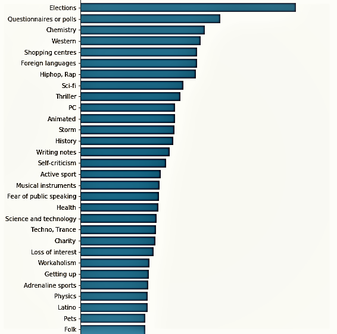

# Supervised Learning for Young Adult Fiction Character Creation

Young Adult fiction genre continues to be among the best sellers in the world. The general premise remains simple, a small band of special young people are placed in extraordinary circumstances, usually created and perpetuated by the adults of that world, and who must overcome the dangers and oppressions of said adults. The importance of having believable characters that the youth market can relate to cannot be overstated. Indeed billions are spent each year by marketing firms trying to ensure that the representatives they offer their youth market are as authentic as possible, with such a narrow margin of error tolerated by the market. 

In this Capstone I will be processing a 150 question survey by over 1000 respondants to create a predictive model for the age of the respondent. The hope is that the age (and if the model user wishes, gender) can be accurately predicted given an input of responses about interests, preferences, hobbies, fears, health habits, personality traits, life views, spending habits, and general demographics. Using different supervised learning models to determine the superior method, this data can be used to flesh out characters in today's world by age, gender, and other general attributes by the imporance they place on the survey data. 

## Part I - The Data

Retrieved from Kaggle, the [Young People Survey](https://www.kaggle.com/miroslavsabo/young-people-survey) data is comprised of mostly ranked integer responses with some some columns of categorical text selections. A few examples of this are:

Horror Movies  | Physics | Law
------------ | ------------- | -------------
3 | 4 | 1
1 | 3 | 4
2 | 2 | 3
3 | 1 | 4

## Part II - Preprocessing :paperclip: 
#### Stages:
- [x]  Identify null values
- [x]  Separate categorical data for one-hot encoding
- [x]  Create one-hot encoding features
- [x]  Imputation of missing data with most frequent
- [x]  Upsample minority classes to remove class imbalance

## Part III - Modeling

For the train/test split data I ran a number of supervised learning models attempting to maximize the ability to predict the age of the respondant. Results as follows:

Model | Best Score
------------ | -------------
Ordinary Least Squares | 65.0%
Ridge Regression | 70.0%
KNN Regression | 73.8%
Support Vector Machines | 86.0%
KNN Regression (PCA) | 88.7%
Gradient Boosting | 90.3%

The most important features calculated for the Gradient Boosting (clf) using clf.feature_importances_:

## Part IV - Joey

Finally, by altering a respondant's survey responses a person using this tool can very accurately claim the age of the character. This can be accomplished for any other aspect of the character as well. In this case, I created the responses for character "Joey" "Joey" has values that differ from the mode for features: 'Country', 'Classical Music', 'Hiphop, Rap', 'Reggae, Ska', 'Mathematics', 'Physics', 'Cars', 'Loss of interest', 'God', 'Punctuality', 'Lying', & 'Internet Usage'. 

#### clf.predict: 23.26 Years

